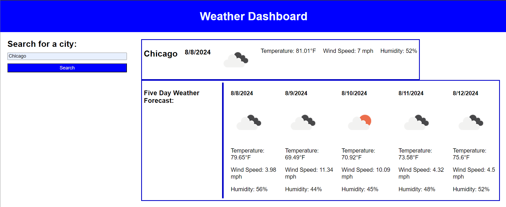

# Weather Dashboard

## Description

The Weather Dashboard is a web application that provides users with real-time weather data, including current conditions and a five-day forecast for any city. The motivation behind this project was to create an intuitive and responsive interface for quickly accessing weather information. It was built to solve the problem of obtaining accurate and up-to-date weather data in a user-friendly format. Through this project, I learned how to integrate third-party APIs, dynamically update the DOM, and manage layout with CSS flexbox.

## Table of Contents (Optional)

- [Installation](#installation)
- [Usage](#usage)
- [Credits](#credits)
- [License](#license)

## Installation

To run the Weather Dashboard locally, follow these steps:

1. Clone the repository:
    ```bash
    git clone https://github.com/ogchromebook/weather-dashboard
    ```
2. Navigate to the project directory:
    ```bash
    cd weather-dashboard
    ```
3. Open the `index.html` file in your browser to view the application.

No additional installations or dependencies are required, as this is a simple HTML, CSS, and JavaScript project.

## Usage

Upon opening the Weather Dashboard, you will be greeted with a search form on the left side of the screen where you can enter the name of a city. Once you submit the form, the application fetches weather data from the OpenWeatherMap API and displays:

- **Current Weather**: This section shows the city name, the current date, temperature, wind speed, humidity, and an icon representing the current weather conditions.
  
- **Five-Day Forecast**: Below the current weather section, a five-day weather forecast is displayed, showing the temperature, wind speed, humidity, and weather conditions for each day.

### Screenshot



The layout is designed to be responsive, making it easy to use on both desktop and mobile devices.

### Key Features Implemented in JavaScript:

- **Fetching Weather Data**: The `getWeather()` function is triggered upon form submission. It sends two API requests to OpenWeatherMap—one for the current weather and one for the five-day forecast.

- **Dynamic DOM Updates**: The weather data is dynamically displayed in the `#currentWeather` and `#fiveDayWeather` sections using JavaScript. Elements such as headings, paragraphs, and images are created and populated with the API data before being appended to the DOM.

- **Date Conversion**: The Unix timestamps provided by the API are converted to a readable date format using JavaScript's `Date` object.

- **Responsive Weather Icons**: Weather condition icons are retrieved from OpenWeatherMap and displayed alongside the weather data.

## Credits

This project was built by [Sam Kachergius](https://github.com/ogchromebook).

- [OpenWeatherMap API](https://openweathermap.org/api) for weather data.
- Andru Sanchez (My Tutor!)

## License

This project is licensed under the MIT License. See the [LICENSE](LICENSE) file for details.

---

## Badges


## Features

- Search for any city to get the current weather and a five-day forecast.
- Dynamic and responsive weather data display.
- Weather icons corresponding to current conditions.
- Responsive design ensures usability on all devices.

## How to Contribute

Contributions are welcome! If you'd like to contribute to the project, please fork the repository and create a new branch for your feature or bug fix. Once your changes are ready, submit a pull request.

## Tests

Currently, there are no automated tests for this project. However, you can manually test the functionality by entering various city names and ensuring that the correct weather data is displayed.
